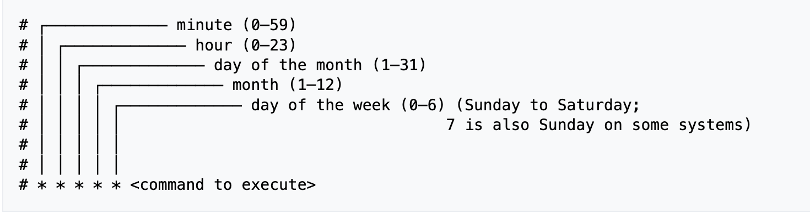

# cron
`cron`은 유닉스 계열 운영 체제의 작업 스케줄러입니다.
`cron`의 작업은 지정된 일정에 따라 주기적으로 실행할 셸 명령을 지정하는 구성 파일인 `crontab`(cron table) 파일에 의해 구동됩니다. `crontab` 파일은 작업 목록과 크론 데몬에 대한 기타 지침이 저장되는 위치에 저장됩니다. 사용자는 개별 `crontab` 파일을 가질 수 있으며, 시스템 관리자만 편집할 수 있는 시스템 전체 `crontab` 파일(일반적으로 /etc 또는 /etc의 하위 디렉터리(예: /etc/cron.d)에 있음)이 있는 경우가 많습니다.

