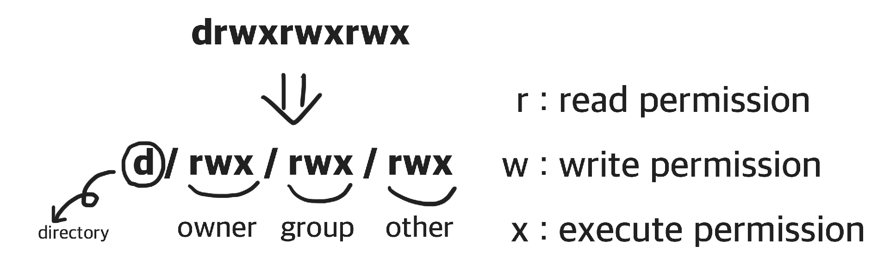

# 사용권한
</img>
***
> ### user, group, and other
**user(owner)** : 
* `user`는 파일의 소유자입니다. 기본적으로 파일을 마든 사람이 소유자가 됩니다. 따라서 `user`를 소유자라고 하기도 합니다.

**group**:
* `group`에는 여러 `user`가 포함될 수 있습니다. 그룹에 속한 모든 `user`는 파일에 대한 동일한 `group` 액세스 권한을 갖습니다. 많은 사람이 파일에 액세스해야 하는 프로젝트가 있다고 가정합니다. 각 `user`에게 일일이 권한을 할당하는 대신에 모든 `user`를 `group`에 추가하고 파일에 `group` 권한을 할당할 수 있습니다. 

**other**
* 파일에 대한 액세스 권한이 있는 다른 `user`입니다. 파일을 만들지 않은 다른 모든 `user`를 의미합니다. 따라서 `other` 권한을 설정하면, 해당 권한을 global 권한 설정이라고 볼 수도 있습니다.
***
> ### chmod: 권한을 변경하는 명령어
명령어 `chmod` 폴더나 파일의 읽기, 쓰기, 실행 권한을 변경할 수 있습니다. OS에 로그인한 사용자와, 폴더나 파일의 소유자가 같을 경우에 명령어 `chmod` 로 폴더나 파일의 권한을 변경할 수 있습니다. 만약 OS에 로그인한 사용자와, 폴더나 파일의 소유자가 다를 경우에는 관리자 권한을 획득하는 명령어 `sudo` 를 이용해 폴더나 파일의 권한을 변경할 수 있습니다.

명령어 chmod 로 권한을 변경하는 방식은 두 가지가 있습니다.
* 첫 번째는 더하기(+), 빼기(-), 할당(=)과 액세서 유형을 표기해서 변경하는 Symbolic method입니다.
* 두 번째는 rwx를 3 bit로 해석하여, 숫자 3자리로 권한을 표기해서 변경하는 Absolute form입니다.

**Symbolic method는 액세스 클래스, 연산자, 액세스 타입으로 구분합니다.**

|**Access class**|**Operator**|**Access Type**|
|:-:|:--:|:-:|
|u(user)|+(add access)|r(read)|
|g(group)|-(remove access)|w(write)|
|o(ogher)|=(set exact access)|x(execute)|
|a(all: u,g,o)|||

**Absolute form은 숫자 7까지 나타내는 3 bits의 합으로 표기합니다.**
|**permission**|**Number**|
|:-:|:-:|
|Read(r)|4|
|Write(w)|2|
|Execute(x)|1|

||**sum**|**rwx**|**Permission**|
|:-:|:-:|:-:|:-:|
|7|4(r) + 2(w) + 1(x)|rwx|read, write and execute|
|6|4(r) + 2(w) + 0(-)|rw-|read and write|
|5|4(r) + 0(-) + 1(x)|r-x|read and execute|
|4|4(r) + 0(-) + 0(-)|r--|read only|
|3|0(-) + 2(w) + 1(x)|-wx|write and execute|
|2|0(-) + 2(w) + 0(-)|-w-|write only|
|1|0(-) + 0(-) + 1(x)|--x|execute only|
|0|0(-) + 0(-) + 0(-)|---|none|