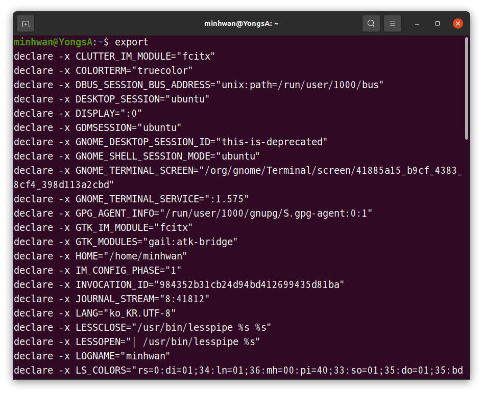
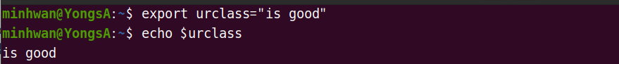
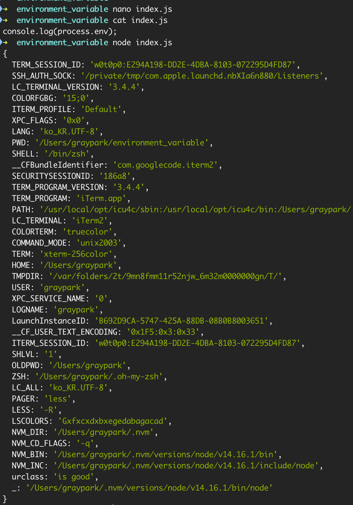
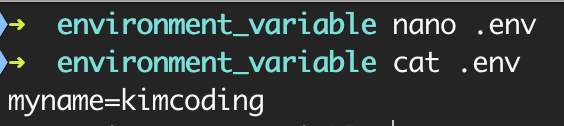
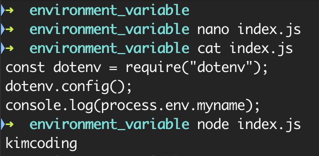
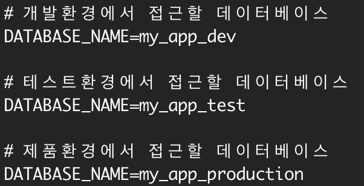

# 환경변수
> ## **export: 환경변수 확인하기 && 환경변수 임시적용**
Linux 운영체제에는 이미 많은 환경변수가 설정되어 있습니다. 터미널에 명령어 `export` 를 입력해, 기록된 환경변수를 확인할 수 있습니다.


명령어 `export` 를 이용하면, 새로운 환경변수를 추가할 수 있습니다. 다음과 같이 새로운 환경변수 `urclass="is good"` 을 설정합니다. 이 때 **등호 표시(Equal sign, =) 앞뒤에는 반드시 공백이 없어야 합니다.**
```js
export urclass="is good"
```
명령어 `echo` 와 함께 환경변수를 입력하면, 환경변수의 값을 확인할 수 있습니다. 이때 환경변수의 앞에는 달러사인(`$`)을 입력하여, 변수라는 뜻을 터미널에 전달합니다.



***
> ## **dotenv: 자바스크립트에서 환경변수 사용하기**
npm 모듈 dotenv를 사용하면, 자바스크립트에서 환경변수를 사용할 수 있습니다. npm 모듈을 설치하고 사용하기 위해서, 새로운 폴더를 만들고 `npm init` 을 입력합니다. 그리고 `npm i dotenv` 를 입력해 모듈을 설치합니다. 이때 생성된 폴더는 설치할 모듈과 이름이 같아서는 안됩니다.

```js
mkdir environment_variable
cd environment_variable
npm init //엔터 키를 여러번 입력해 init을 마칩니다.
npm i dotenv //dotenv 모듈을 설치합니다.
```
설치한 dotenv를 이용해 환경변수에 접근할 수 있습니다. 새로운 파일 index.js를 생성하고, `process.env` 를 출력합니다. Node.js의 내장 객체 `process.env`를 이용하면, 명령어 `export` 로 확인한 내용과 동일한 내용을 객체로 출력합니다.



***
> ## **env: Node.js에서 환경변수 영구 적용**
명령어 `export` 로 적용한 환경변수는 현재 사용 중인 터미널에서만 임시로 사용이 가능합니다. 환경변수를 Linux 운영체제에 저장하는 방법은 여러 가지가 있지만, Node.js에서는 파일 `.env`를 만들어 저장하는 방법을 사용합니다.

먼저 `.env` 파일을 생성하고, 사용하고자 하는 환경변수를 입력한 뒤 저장합니다.    



모듈 `dotenv`를 이용하면, 파일 `.env`에 저장한 환경변수를 조회할 수 있습니다. index.js를 다음과 같이 수정하고, 저장합니다.
```js
const dotenv = require("dotenv");
dotenv.config();
console.log(process.env.myname);
```

그다음 index.js를 실행하면 다음과 같은 결과를 얻을 수 있습니다.



환경변수를 이용해 API key, DB password와 같이 민감한 정보를 저장하고 관리할 수 있습니다. 그뿐만 아니라 서로 다른 PC 또는 여러 .env 파일에서, 같은 변수 이름에 다른 값을 할당할 수 있습니다.

실제 제품(서비스)을 개발하는 과정에는 개발 환경(local 또는 development 등)과 테스트 서버의 환경(test), 그리고 실제 제품을 제공하는 환경(production)이 있습니다. 예를 들어 구글 API를 이용해 웹 애플리케이션을 만드는 경우, 개발 환경에서는 개발자 개인의 API 키를 이용할 수 있습니다. 그러나 제품을 서비스할 때에 개인 API 키를 사용하면, 일일 요청량을 초과하는 경우 제품이 정상적인 동작을 할 수 없습니다. 이런 경우를 방지하기 위해 실제 제품에서는 기업용 API 키를 사용합니다. 이처럼 개발 환경과 제품을 제공하는 환경에서 사용하는 API 키가 다른 경우, 환경변수를 이용해 환경을 구분하여 코드를 작성할 수 있습니다.

데이터베이스도 마찬가지로 개발, 테스트, 제품 환경으로 구분할 수 있습니다. 다음 그림은 각기 다른 환경에, 같은 변수 이름을 사용하여 데이터베이스를 구분한 예시입니다.

